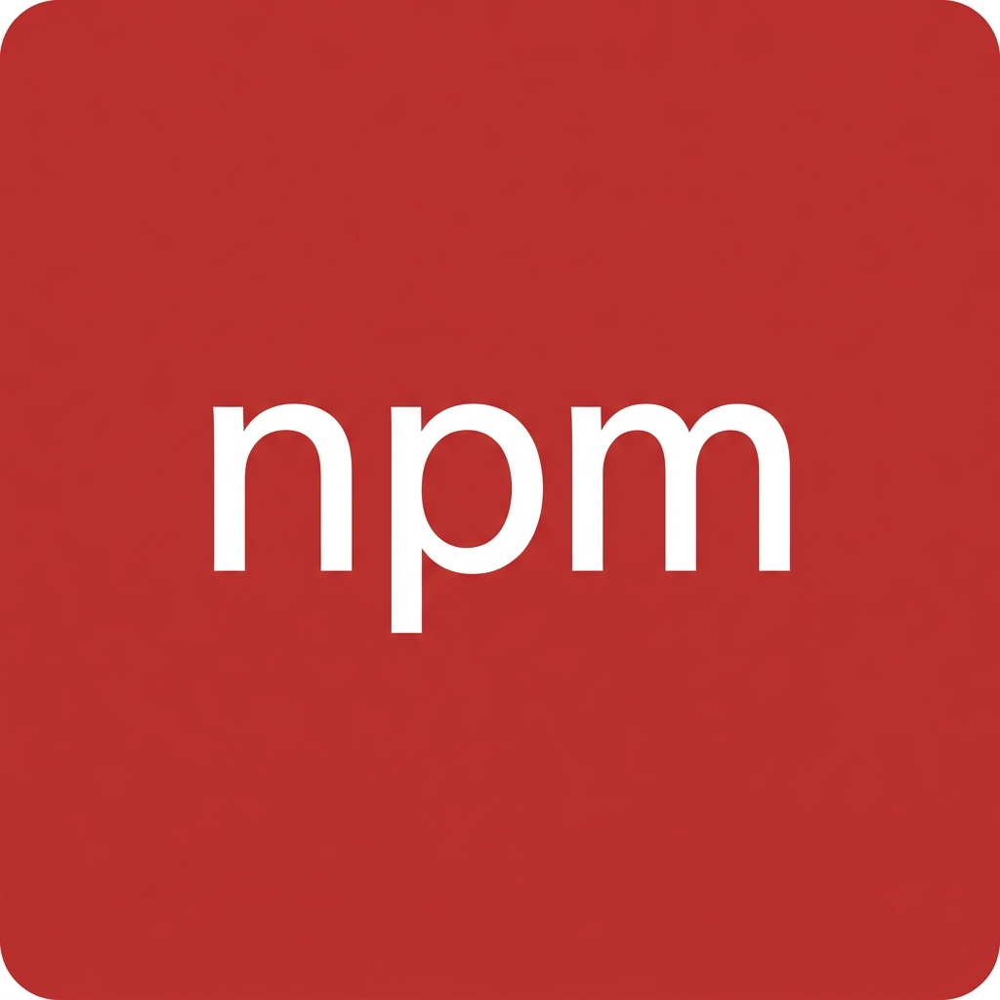

# NPM Manager for VS Code

NPM Manager provides a modern, visual interface for managing your Node.js project's dependencies directly within VS Code. Say goodbye to terminal-only package management and experience a more intuitive, dashboard-driven workflow.

## Features

- **🚀 Visual Exploration:** Search through the live NPM registry with ease.
- **📦 Effortless Management:** Install, update, and uninstall packages with a single click.
- **✨ Version Insights:** View current, wanted, and latest versions in an elegant "Updates" dashboard.
- **🛠️ Project-Centric:** Focus on your project's `package.json` with dedicated "Dependencies" and "Dev Dependencies" views.
- **⚡ Native Feel:** Designed to match your VS Code theme perfectly.

## Usage

1.  Open the **NPM Manager** sidebar from the Activity Bar.
2.  **Browse:** Search for any package in the NPM registry and click "Install".
3.  **Installed:** Manage your project's current dependencies.
4.  **Updates:** Check for and apply the latest package updates with a single click.

## License

This project is licensed under the [MIT License](LICENSE).
